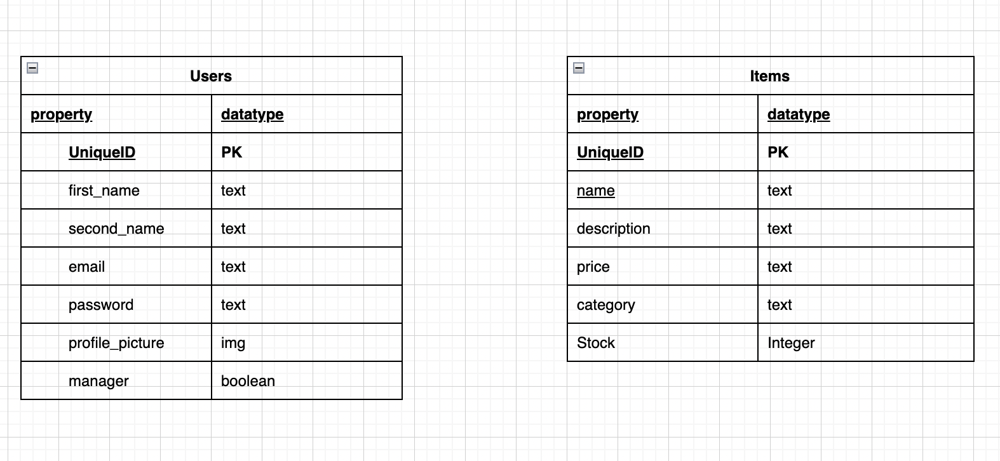
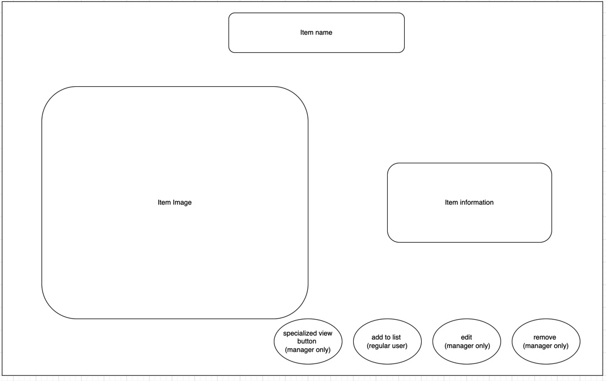
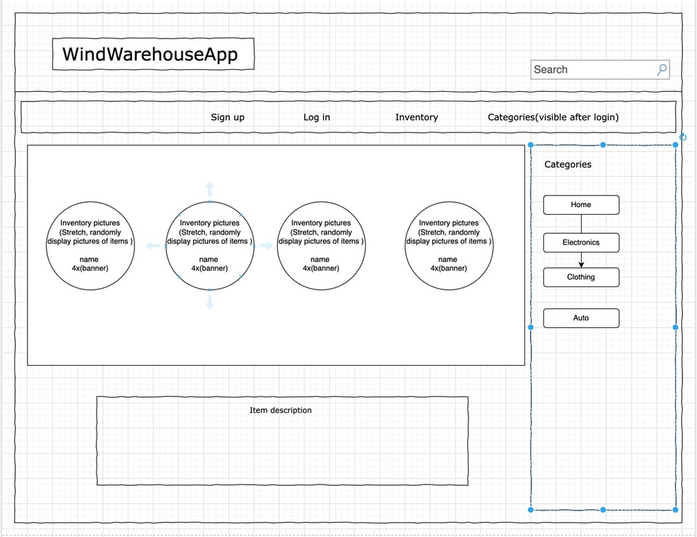

# Wind Warehouse 
### By: Shafee Rushdan, Abdulrazaq Alagbada and Andés Nuñez Tinajero

### Description

An application for a warehouse where employees(users) can login and add new items to the inventory. Only managers can edit or remove inventory.

### Technologies Used
- React
- Node
- Express
- Redux
- Sequelize 
- Sqlite
- Axios

### Entity Relationship Diagram

### Wireframes

